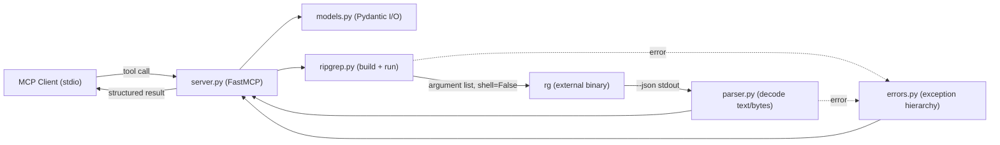

Created: 2026 June 24

# Design (Master) — mcp-ripgrep

---

## Table of Contents

[1.0 Overview](<#1.0 overview>)
[2.0 Architecture Diagram](<#2.0 architecture diagram>)
[3.0 Design Specification](<#3.0 design specification>)
[4.0 References](<#4.0 references>)
[Version History](<#version history>)

---

## 1.0 Overview

Master design (T01, protocol P02) for the mcp-ripgrep server. A single small
package is involved, so this master document details components inline; the
domain and component design tiers are intentionally omitted at this scale and
may be added later if complexity grows.

Requirements baseline: `requirements-ca02a3db-mcp-ripgrep.md`. This document is
`active` and requires human approval to baseline before prompt authoring (P09).

[Return to Table of Contents](<#table of contents>)

---

## 2.0 Architecture Diagram



Purpose: shows tool dispatch through input validation, command construction,
subprocess execution, and JSON parsing back to the client. The dashed edges show
error propagation. Legend: solid = data flow; dashed = error flow.

[Return to Table of Contents](<#table of contents>)

---

## 3.0 Design Specification

```yaml
project_info:
  name: "mcp-ripgrep"
  version: "0.1.0"
  date: "2026-06-24"
  author: ""

scope:
  purpose: "Expose ripgrep (rg) search to MCP clients over stdio, with cross-platform (Windows and macOS) correctness as the defining constraint."
  in_scope:
    - "Four consolidated tools: search, count-matches, list-files, list-file-types."
    - "rg invocation via subprocess argument list; --json parsing with text/bytes decoding."
    - "Actionable error reporting; stderr-only diagnostics."
  out_scope:
    - "Bundling or installing the rg binary."
    - "Network/HTTP transport, authentication."
    - "Domain and component design tiers (not warranted at this scale)."
  terminology:
    - term: "stdio transport"
      definition: "MCP communication over stdin/stdout; stdout is reserved for the protocol stream."
    - term: "data element"
      definition: "A ripgrep --json value object keyed by 'text' or, for non-UTF-8 data, 'bytes' (base64)."

system_overview:
  description: "A FastMCP stdio server. Each tool validates input, constructs an rg argument list, runs rg as a subprocess, parses output, and returns a structured result."
  context_flow: "MCP Client → server.py → ripgrep.py → rg → parser.py → server.py → MCP Client"
  primary_functions:
    - "search: structured matches via rg --json"
    - "count-matches: per-file and total counts"
    - "list-files: enumerate searchable files or files with matches"
    - "list-file-types: enumerate rg type definitions"

design_constraints:
  technical:
    - "rg invoked with an argument list, shell=False; no manual quoting (req 920668bb)."
    - "Diagnostics to stderr only; stdout reserved for the stdio protocol (req af695f17)."
    - "Handle text and bytes data elements; tolerate non-UTF-8 (req b2e1dfdd)."
  implementation:
    language: "Python"
    framework: "FastMCP (mcp.server.fastmcp)"
    libraries:
      - "mcp>=1.27,<2"
      - "pydantic (provided via mcp)"
    standards:
      - "PEP 8"
      - "type hints on public interfaces"
      - "Google-style docstrings"
  performance_targets:
    - metric: "result bound"
      value: "search honours a configurable max-results cap (default DEFAULT_MAX_RESULTS)"

development_environment:
  platform: "macOS 14+ and Windows 11"
  python_version: "3.9+"
  toolchain:
    - "pytest"
    - "pytest-asyncio"
    - "pytest-cov"
    - "black"
    - "isort"
    - "flake8"
    - "mypy"

target_platform:
  type: "desktop"
  os: "Windows and macOS"
  architecture: "x86_64 and ARM64"
  constraints:
    - "rg must be present on PATH."

architecture:
  pattern: "layered pipeline (adapter -> builder -> subprocess -> parser)"
  component_relationships: "server -> {models, ripgrep}; ripgrep -> rg; rg -> parser; {ripgrep, parser} -> errors -> server"
  technology_stack:
    language: "Python 3.9+"
    framework: "FastMCP (official mcp SDK)"
    libraries:
      - "mcp"
      - "pydantic"
    data_store: "none"
  directory_structure:
    - "src/mcp_ripgrep/__init__.py"
    - "src/mcp_ripgrep/__main__.py"
    - "src/mcp_ripgrep/server.py"
    - "src/mcp_ripgrep/ripgrep.py"
    - "src/mcp_ripgrep/parser.py"
    - "src/mcp_ripgrep/models.py"
    - "src/mcp_ripgrep/errors.py"
    - "tests/"

components:
  - name: "server"
    purpose: "FastMCP application; registers the four tools as thin async adapters."
    responsibilities:
      - "Instantiate FastMCP and register tools with explicit hyphenated names."
      - "Delegate to ripgrep + parser; never construct commands itself."
      - "Run over stdio via mcp.run()."
    inputs:
      - field: "tool arguments"
        type: "Pydantic models"
        description: "Validated per-tool input."
    outputs:
      - field: "tool results"
        type: "Pydantic models"
        description: "Structured output returned to the client."
    key_elements:
      - name: "search"
        type: "function"
        purpose: "Tool: structured search (req e1e3a1c8)."
      - name: "count_matches"
        type: "function"
        purpose: "Tool: count lines or matches (req d76b2602)."
      - name: "list_files"
        type: "function"
        purpose: "Tool: enumerate files (req eaecf140)."
      - name: "list_file_types"
        type: "function"
        purpose: "Tool: enumerate rg types (req 3a7478f7)."
    dependencies:
      internal:
        - "models"
        - "ripgrep"
        - "parser"
        - "errors"
      external:
        - "mcp.server.fastmcp"
    processing_logic:
      - "Receive validated input; build args via ripgrep.build_command; await ripgrep.run_rg; parse; return model."
    error_conditions:
      - condition: "RipgrepError raised"
        handling: "Surface as an actionable tool error message."
  - name: "ripgrep"
    purpose: "Construct rg argument lists and execute rg as a subprocess."
    responsibilities:
      - "build_command: pure function mapping tool parameters to an rg argument list (req 920668bb)."
      - "run_rg: async subprocess execution with shell=False; capture stdout/stderr/returncode."
      - "Resolve rg on PATH; raise RgNotFoundError if absent (req 14c2e121)."
    inputs:
      - field: "parameters"
        type: "dict / typed args"
        description: "Validated tool parameters."
    outputs:
      - field: "RgResult"
        type: "dataclass"
        description: "stdout, stderr, returncode."
    key_elements:
      - name: "build_command"
        type: "function"
        purpose: "Pure rg argument-list construction."
      - name: "run_rg"
        type: "function"
        purpose: "Async subprocess execution."
    dependencies:
      internal:
        - "errors"
      external:
        - "asyncio"
        - "shutil"
    processing_logic:
      - "build_command appends flags and ends with [pattern, path]; never quotes."
      - "run_rg uses asyncio.create_subprocess_exec(*args); exit 1 = no match, exit 2 = error (req f6954177)."
    error_conditions:
      - condition: "rg not on PATH"
        handling: "raise RgNotFoundError."
      - condition: "returncode == 2"
        handling: "raise RipgrepExecutionError with stderr."
  - name: "parser"
    purpose: "Parse rg --json output and decode data elements."
    responsibilities:
      - "parse_search_json: iterate JSON-object lines; collect match records."
      - "decode_data: return text directly, or base64-decode bytes (req b2e1dfdd)."
    inputs:
      - field: "stdout"
        type: "str"
        description: "rg --json output."
    outputs:
      - field: "matches"
        type: "list[Match]"
        description: "Parsed match records."
    key_elements:
      - name: "parse_search_json"
        type: "function"
        purpose: "Parse the five message types; retain begin/match/context/end/summary as needed."
      - name: "decode_data"
        type: "function"
        purpose: "text/bytes decoding."
    dependencies:
      internal:
        - "models"
      external:
        - "json"
        - "base64"
    processing_logic:
      - "Split stdout into lines; json.loads each; dispatch on the 'type' field."
      - "For data values, call decode_data to obtain a str."
    error_conditions:
      - condition: "malformed JSON line"
        handling: "skip the line; do not crash."
  - name: "models"
    purpose: "Pydantic input/output models for tools and results."
    responsibilities:
      - "Define per-tool input models and result models for FastMCP schema generation."
    key_elements:
      - name: "SearchInput"
        type: "class"
        purpose: "search parameters."
      - name: "Match"
        type: "class"
        purpose: "A single match: path, line_number, text."
      - name: "SearchResult"
        type: "class"
        purpose: "matches + summary."
      - name: "CountResult"
        type: "class"
        purpose: "per-file counts + total."
      - name: "FileList"
        type: "class"
        purpose: "list of file paths."
      - name: "TypeList"
        type: "class"
        purpose: "type name + globs entries."
    dependencies:
      internal: []
      external:
        - "pydantic"
    processing_logic:
      - "Models are declarative; no behaviour beyond validation."
    error_conditions:
      - condition: "invalid input"
        handling: "Pydantic ValidationError surfaced by FastMCP."
  - name: "errors"
    purpose: "Exception hierarchy and actionable-message mapping."
    responsibilities:
      - "Define RipgrepError base and specific exceptions (req f6954177)."
    key_elements:
      - name: "RipgrepError"
        type: "class"
        purpose: "Base exception."
      - name: "RgNotFoundError"
        type: "class"
        purpose: "rg not on PATH."
      - name: "SearchPathError"
        type: "class"
        purpose: "search path does not exist."
      - name: "RipgrepExecutionError"
        type: "class"
        purpose: "rg exited with code 2."
    dependencies:
      internal: []
      external: []
    processing_logic:
      - "Each exception carries a human-readable, actionable message."
    error_conditions: []

data_design:
  entities:
    - name: "Match"
      purpose: "Transient representation of one rg match."
      attributes:
        - name: "path"
          type: "str"
          constraints: "decoded from text/bytes"
        - name: "line_number"
          type: "int | None"
          constraints: "present when line numbers enabled"
        - name: "text"
          type: "str"
          constraints: "decoded matched line"
      relationships:
        - target: "SearchResult"
          type: "many-to-one"
  storage: []
  validation_rules:
    - "Tool inputs validated by Pydantic before command construction."

interfaces:
  internal:
    - name: "build_command"
      purpose: "Construct an rg argument list."
      signature: "build_command(tool: str, params: BaseModel) -> list[str]"
      parameters:
        - name: "tool"
          type: "str"
          description: "One of search, count-matches, list-files, list-file-types."
        - name: "params"
          type: "BaseModel"
          description: "Validated tool parameters."
      returns:
        type: "list[str]"
        description: "Argument list beginning with 'rg'."
      raises: []
    - name: "run_rg"
      purpose: "Execute rg asynchronously."
      signature: "async run_rg(args: list[str]) -> RgResult"
      parameters:
        - name: "args"
          type: "list[str]"
          description: "rg argument list."
      returns:
        type: "RgResult"
        description: "stdout, stderr, returncode."
      raises:
        - exception: "RgNotFoundError"
          condition: "rg not on PATH"
        - exception: "RipgrepExecutionError"
          condition: "returncode == 2"
    - name: "parse_search_json"
      purpose: "Parse rg --json output."
      signature: "parse_search_json(stdout: str) -> list[Match]"
      parameters:
        - name: "stdout"
          type: "str"
          description: "rg --json output."
      returns:
        type: "list[Match]"
        description: "Parsed matches."
      raises: []
    - name: "decode_data"
      purpose: "Decode a data element."
      signature: "decode_data(elem: dict) -> str"
      parameters:
        - name: "elem"
          type: "dict"
          description: "Object keyed by 'text' or 'bytes'."
      returns:
        type: "str"
        description: "Decoded string."
      raises: []
  external:
    - name: "MCP tools"
      protocol: "MCP over stdio"
      data_format: "JSON-RPC"
      specification: "search, count-matches, list-files, list-file-types"
    - name: "ripgrep"
      protocol: "subprocess (CLI)"
      data_format: "rg --json on stdout"
      specification: "rg invoked with an argument list, shell=False"

error_handling:
  exception_hierarchy:
    base: "RipgrepError"
    specific:
      - "RgNotFoundError"
      - "SearchPathError"
      - "RipgrepExecutionError"
  strategy:
    validation_errors: "Pydantic validates tool inputs; FastMCP returns the validation error."
    runtime_errors: "Map rg exit codes: 1 = no matches (empty result), 2 = error (RipgrepExecutionError)."
    external_failures: "Missing rg on PATH raises RgNotFoundError naming the binary."
  logging:
    levels:
      - "INFO"
      - "ERROR"
    required_info:
      - "tool name"
      - "rg returncode"
    format: "concise; stderr only"

nonfunctional_requirements:
  performance:
    - metric: "result bound"
      target: "search caps results via -m / DEFAULT_MAX_RESULTS (req 065a7579)"
  security:
    authentication: "none (local stdio)"
    authorization: "none"
    data_protection:
      - "No shell invocation; arguments passed as a list (req 32109138)."
  reliability:
    error_recovery: "Empty results are normal; malformed JSON lines are skipped."
    fault_tolerance:
      - "Cross-platform path handling; Windows and POSIX paths accepted (req 98378a50)."
  maintainability:
    code_organization:
      - "Pure functions for command construction and parsing; I/O at the edges."
    documentation:
      - "Google-style docstrings on public interfaces."
    testing:
      coverage_target: "command construction and parsing fully covered"
      approaches:
        - "Unit tests for build_command across both path separators."
        - "Parser tests with text and bytes data elements."
        - "Exit-code mapping tests (1 vs 2)."

element_registry:
  packages:
    - name: "mcp_ripgrep"
      path: "src/"
  modules:
    - name: "mcp_ripgrep.server"
      path: "src/mcp_ripgrep/server.py"
      package: "mcp_ripgrep"
    - name: "mcp_ripgrep.ripgrep"
      path: "src/mcp_ripgrep/ripgrep.py"
      package: "mcp_ripgrep"
    - name: "mcp_ripgrep.parser"
      path: "src/mcp_ripgrep/parser.py"
      package: "mcp_ripgrep"
    - name: "mcp_ripgrep.models"
      path: "src/mcp_ripgrep/models.py"
      package: "mcp_ripgrep"
    - name: "mcp_ripgrep.errors"
      path: "src/mcp_ripgrep/errors.py"
      package: "mcp_ripgrep"
  classes:
    - name: "SearchInput"
      module: "mcp_ripgrep.models"
      base_classes:
        - "BaseModel"
    - name: "Match"
      module: "mcp_ripgrep.models"
      base_classes:
        - "BaseModel"
    - name: "SearchResult"
      module: "mcp_ripgrep.models"
      base_classes:
        - "BaseModel"
    - name: "CountResult"
      module: "mcp_ripgrep.models"
      base_classes:
        - "BaseModel"
    - name: "FileList"
      module: "mcp_ripgrep.models"
      base_classes:
        - "BaseModel"
    - name: "TypeList"
      module: "mcp_ripgrep.models"
      base_classes:
        - "BaseModel"
    - name: "RipgrepError"
      module: "mcp_ripgrep.errors"
      base_classes:
        - "Exception"
    - name: "RgNotFoundError"
      module: "mcp_ripgrep.errors"
      base_classes:
        - "RipgrepError"
    - name: "SearchPathError"
      module: "mcp_ripgrep.errors"
      base_classes:
        - "RipgrepError"
    - name: "RipgrepExecutionError"
      module: "mcp_ripgrep.errors"
      base_classes:
        - "RipgrepError"
  functions:
    - name: "build_command"
      module: "mcp_ripgrep.ripgrep"
      signature: "build_command(tool: str, params: BaseModel) -> list[str]"
    - name: "run_rg"
      module: "mcp_ripgrep.ripgrep"
      signature: "async run_rg(args: list[str]) -> RgResult"
    - name: "parse_search_json"
      module: "mcp_ripgrep.parser"
      signature: "parse_search_json(stdout: str) -> list[Match]"
    - name: "decode_data"
      module: "mcp_ripgrep.parser"
      signature: "decode_data(elem: dict) -> str"
  constants:
    - name: "RG_BINARY"
      module: "mcp_ripgrep.ripgrep"
      type: "str"
    - name: "EXIT_NO_MATCH"
      module: "mcp_ripgrep.ripgrep"
      type: "int"
    - name: "EXIT_ERROR"
      module: "mcp_ripgrep.ripgrep"
      type: "int"
    - name: "DEFAULT_MAX_RESULTS"
      module: "mcp_ripgrep.models"
      type: "int"

version_history:
  - version: "0.1"
    date: "2026-06-24"
    author: ""
    changes:
      - "Initial master design for the Python stdio ripgrep MCP server."

metadata:
  copyright: "Copyright (c) 2026 William Watson. MIT License."
  template_version: "1.0"
  schema_type: "t01_design"
```

[Return to Table of Contents](<#table of contents>)

---

## 4.0 References

GALLANT, A. (BurntSushi), 2026. *rg(1) — ripgrep manual* [online]. Available at: https://manpages.debian.org/testing/ripgrep/rg.1.en.html [Accessed 24 June 2026].

MODEL CONTEXT PROTOCOL, 2026. *python-sdk: the official Python SDK for Model Context Protocol servers and clients* [online]. Available at: https://github.com/modelcontextprotocol/python-sdk [Accessed 24 June 2026].

[Return to Table of Contents](<#table of contents>)

---

## Version History

| Version | Date | Description |
|---|---|---|
| 0.1 | 2026-06-24 | Initial draft. Master design: layered pipeline (server → ripgrep → rg → parser), four-tool surface, exception hierarchy, element registry, and Mermaid architecture diagram. Domain/component tiers intentionally omitted at this scale. |

---

Copyright (c) 2026 William Watson. MIT License.
